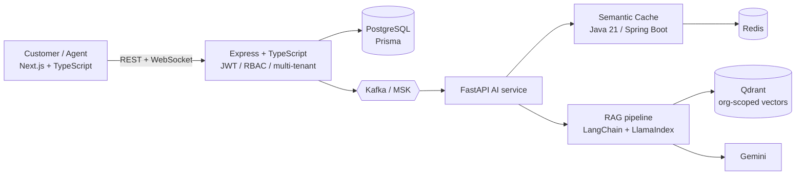
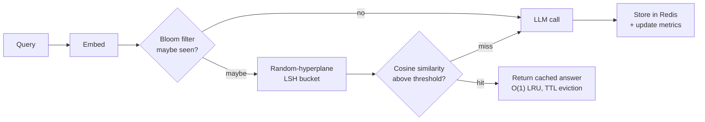
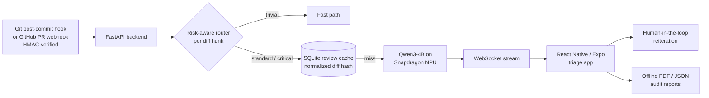
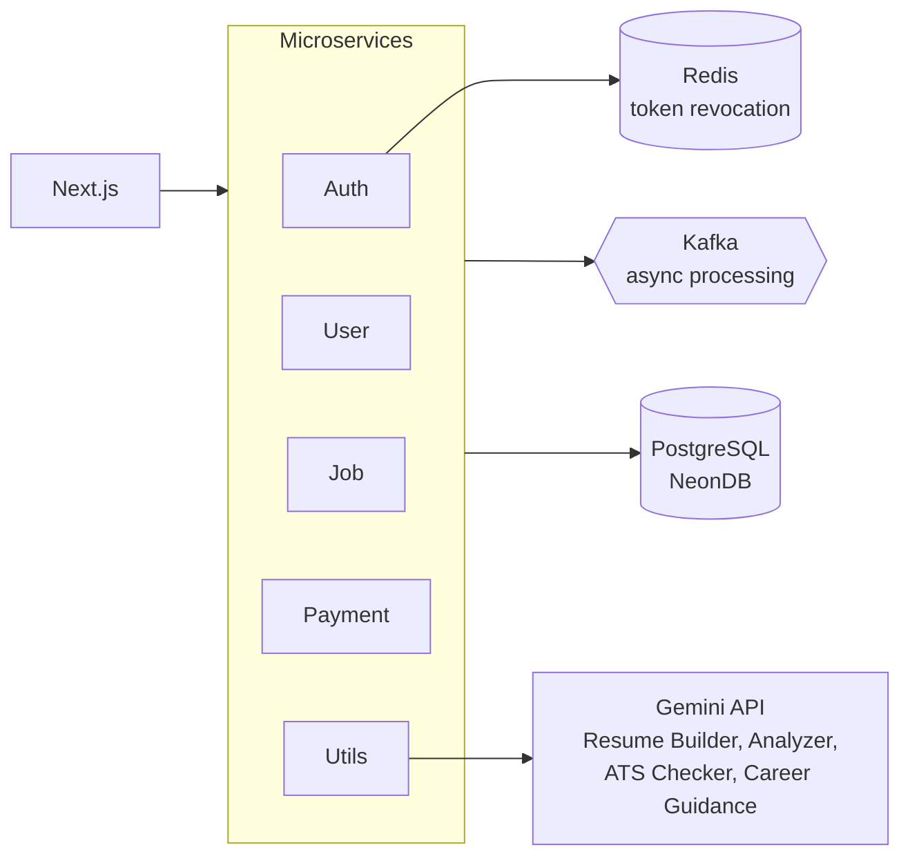

<b>Cloud-native microservices on AWS</b> &nbsp;·&nbsp; <b>RAG and semantic caching</b> &nbsp;·&nbsp; <b>On-device AI</b> &nbsp;·&nbsp; <b>ICPC 2026 Global Rank 1025</b>

   

  

---

## ⚡ At a glance

| 🏆 **ICPC 2026** | 🧠 **Problems solved** | 📊 **Naukri Young Turks** | ☁️ **Production-style infra** | 🔒 **On-device AI** |
|:---:|:---:|:---:|:---:|:---:|
| Global Rank **1025** | **2,000+** across 4 platforms | **96.83** percentile | **AWS + Terraform** CI/CD | **Qwen3-4B** on Snapdragon NPU |

---

## 👋 About me

I'm a **software engineer who builds backend-first products** and pairs them with applied AI. I like systems that are reliable under load: clean API contracts, event-driven pipelines, tenant-safe data models, and infrastructure that is reproducible from code.

I've shipped a **5-service microservices job portal**, a **multi-tenant AI support platform on AWS** provisioned entirely with Terraform, and an **on-device AI code reviewer** where no source code ever leaves the machine. Backed by strong DSA and design-pattern fundamentals.

| | |
|---|---|
| 🔭 **Building** | Multi-tenant AI platforms: RAG, semantic caching, agent workflows |
| 🌱 **Learning** | System design, Kubernetes, cloud architecture at scale |
| 🎓 **Education** | B.Tech CSE, Ambalika Institute of Management and Technology (2023 to 2027) |
| 💼 **Experience** | Web Development Intern at Labmentix (Next.js, React, Tailwind) |
| 🎯 **Looking for** | Software Engineering, Backend and Full-Stack **internships** |
| 🤝 **Open to** | Open-source collaboration and hackathon teams |

---

## 🚀 Featured projects

### 1. Support SaaS: multi-tenant AI support platform
> `Mar 2026 – Jul 2026` · Architecture-heavy, cloud-native, production-style

A multi-tenant support platform with organization-isolated knowledge bases, real-time chat and RAG-grounded AI replies. A dedicated **Java 21 / Spring Boot semantic cache** reduces LLM calls and latency.

**Semantic cache request path**

<b>📌 Engineering highlights</b>

 

- **Architecture:** API-first, domain-driven microservices with JWT/RBAC and strict **tenant isolation** down to the knowledge-base level.
- **Infrastructure as code:** production AWS stack (**ECS Fargate, RDS, ElastiCache, Elasticsearch/OpenSearch, MSK**) provisioned with **Terraform**, deployed through **GitHub Actions OIDC** (no long-lived cloud keys).
- **CI quality gate:** automated API and AI-service test suites gate every pull request.
- **RAG pipeline:** LangChain and LlamaIndex with embeddings, Qdrant and Gemini for org-scoped retrieval.
- **Semantic cache:** O(1) LRU, Bloom filter, random-hyperplane LSH, cosine similarity, Redis, TTL eviction.
- **Resilience:** cache-aside graceful fallback and tenant-aware validation.
- **Observability:** hits, misses, latency, evictions and **LLM requests avoided**.

`Next.js` · `Express` · `FastAPI` · `Java 21` · `Spring Boot` · `AWS` · `Terraform` · `Redis` · `Qdrant` · `Kafka` · `Gemini`

 

### 2. CoderX: private on-device AI code review
> `2026` · Built for the **Snapdragon® Multiverse Hackathon**

An AI code reviewer that runs **Qwen3-4B entirely on a Snapdragon NPU** via GenieX. **Zero source code ever leaves the machine.**

- **Risk-aware routing engine** classifies every diff hunk as critical, standard or trivial *before* it reaches the NPU.
- **Incremental review cache** keyed on normalized diff hashes skips redundant re-reviews.
- **Live findings** stream to a mobile triage app with a human-in-the-loop flow and exportable audit reports.

`Python` · `FastAPI` · `React Native` · `Qwen3-4B` · `Snapdragon NPU` · `GenieX` · `SQLite` · `WebSockets`

 

### 3. NextHire: AI-powered job portal
> `Aug 2025 – Nov 2025`

A **5-service microservices platform** (Auth, User, Job, Payment, Utils) with four AI career tools.

- JWT authentication with **Redis-backed token revocation**; RBAC across services.
- **Kafka** for asynchronous workflows; Redis caching for hot paths.
- Recruiter subscriptions and payments over REST APIs.

`Next.js` · `Node.js` · `PostgreSQL` · `Redis` · `Kafka` · `Gemini`

 

### 4. AI Code Companion: GitHub-integrated developer assistant
> [**▶ Live demo**](https://ai-code-companion-v1-web-app.vercel.app/)

Connect a repository and ship with confidence.

| Capability | What it does |
|---|---|
| 🗂️ **Repository analysis** | Understands structure and codebase layout |
| 🔍 **AI code review** | Automated review feedback |
| 🛡️ **Security scanner** | Surfaces potential vulnerabilities |
| ✅ **Deploy readiness** | Pre-release checks |

[**📂 Browse all repositories →**](https://github.com/Suraj854204?tab=repositories)

---

## 🧰 Tech stack

 

| Category | Technologies |
|---|---|
| **Languages** | Java, TypeScript, JavaScript, Python, C#, SQL |
| **Frontend** | React.js, Next.js, React Native, Tailwind CSS, HTML, CSS, responsive and accessible UI |
| **Backend** | Spring Boot, J2EE / Java EE, .NET, Node.js, Express.js, FastAPI, REST APIs, Microservices, API-first design, JWT, Prisma |
| **Databases and search** | PostgreSQL, MongoDB, Redis, SQLite, Qdrant, Elasticsearch / OpenSearch |
| **AI / GenAI** | LangChain, LlamaIndex, RAG, embeddings, Gemini API, Qwen, on-device / edge inference, vector search, AI agents |
| **Cloud and DevOps** | AWS (ECS Fargate, RDS, ElastiCache, MSK), Terraform, Docker, Kubernetes, GitHub Actions, CI/CD, IaC |
| **CS fundamentals** | Data structures, algorithms, design patterns, OOP, graphs, dynamic programming, heaps, hashing |
| **Practices** | Agile / Scrum, code reviews, system design |

---

## 💼 Experience

**Web Development Intern · Labmentix** `Aug 2025 – Nov 2025 · Remote`

- Built and deployed a **responsive, mobile-first landing page** with reusable Next.js / React components and Tailwind CSS ([grinning.vercel.app](https://grinning.vercel.app)).
- Implemented layouts, navigation, product sections and CTA flows; handled component development and cross-device testing independently.
- Took part in Agile sprint ceremonies and peer code reviews.

---

## 🏆 Competitive programming and achievements

| 🌐 **Contest / Platform** | 🎖️ **Result** |
|:---|:---|
| **ICPC 2026 Online Challenge 1** (powered by Huawei) | Global Rank **1025** |
| **LeetCode** | Contest Global Rank **874** among 27,000+ participants |
| **Codeforces** | Rating **1200** |
| **CodeChef** | DSA Rating **1640** |
| **Naukri Campus Codequezt #31** | Rank **#441** among 14,000+ participants |
| **Pardis Technology Olympics 2026** (Tehran) | Rank **#45** of 1,065 in the Algorithm Track qualifier |
| **Naukri Young Turks 2025** | **96.83 percentile** nationwide |
| **College hackathon** | 🥉 **3rd place**: Image-Provenance Utility using cryptographic signatures |

**Community and leadership:** organized coding and technical events with **100 to 200+ participants** as an Unstop Campus Ambassador and event lead. Ranked in the top 10% of my institute for coding and leadership.

---

## 📈 GitHub analytics

<picture>
  <source media="(prefers-color-scheme: dark)" srcset="https://github-profile-summary-cards.vercel.app/api/cards/profile-details?username=Suraj854204&hide_border=true&theme=tokyonight">
  
</picture>

<picture>
  <source media="(prefers-color-scheme: dark)" srcset="https://github-profile-summary-cards.vercel.app/api/cards/repos-per-language?username=Suraj854204&hide_border=true&theme=tokyonight">
  
</picture>
<picture>
  <source media="(prefers-color-scheme: dark)" srcset="https://github-profile-summary-cards.vercel.app/api/cards/most-commit-language?username=Suraj854204&hide_border=true&theme=tokyonight">
  
</picture>

<picture>
  <source media="(prefers-color-scheme: dark)" srcset="https://github-profile-summary-cards.vercel.app/api/cards/stats?username=Suraj854204&hide_border=true&theme=tokyonight">
  
</picture>
<picture>
  <source media="(prefers-color-scheme: dark)" srcset="https://github-profile-summary-cards.vercel.app/api/cards/productive-time?username=Suraj854204&hide_border=true&theme=tokyonight">
  
</picture>

<picture>
  <source media="(prefers-color-scheme: dark)" srcset="https://streak-stats.demolab.com?user=Suraj854204&theme=tokyonight&hide_border=true&ring=0891b2&fire=06b6d4&currStreakLabel=0891b2&disable_animations=true">
  
</picture>

---

## 🤝 Let's connect

I'm actively looking for **Software Engineering, Backend and Full-Stack internships**. If you're building something with distributed systems, applied AI or developer tooling, I'd love to talk.

  

Built with care. Open to feedback, collaboration and good problems.

