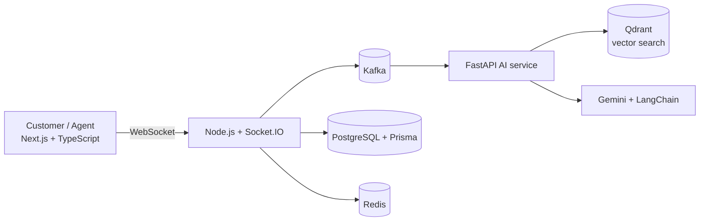

 

---

## About

I build backend-first products that combine event-driven architecture with applied AI. I design reliable APIs, real-time systems and retrieval-augmented generation (RAG) pipelines, and ship them as complete, containerized applications.

|  |  |
|---|---|
| **Building** | AI developer tools with FastAPI, Gemini, LangChain and RAG |
| **Learning** | System design and cloud architecture |
| **Academics** | Ranked among the top 5 students in my college |
| **Problem solving** | 1800+ problems solved across competitive programming platforms |
| **Open to** | Backend and full-stack roles, internships, open-source collaboration |

---

## Featured projects

### Support SaaS: AI-powered customer support platform

A multi-service support platform with real-time chat, asynchronous event processing, and AI replies grounded in a knowledge base.

| Layer | Technologies |
|---|---|
| Frontend | Next.js, TypeScript |
| Backend | Node.js, FastAPI, Socket.IO |
| Data and messaging | PostgreSQL, Prisma, Redis, Kafka |
| AI | Gemini, LangChain, Qdrant |
| Infra | Docker |

### AI Code Companion: GitHub-integrated developer assistant

Connects to a GitHub repository and helps developers understand and ship code with confidence. [**Live demo**](https://ai-code-companion-v1-web-app.vercel.app/)

- **Repository analysis:** structure and codebase understanding
- **AI code review:** automated review feedback
- **Security scanner:** surfaces potential vulnerabilities
- **Deploy readiness:** pre-release checks

### NextHire: AI-powered hiring platform

Automates resume screening and candidate-to-job matching.

- **Resume analysis** and **ATS-style matching**
- **Kafka** event processing for asynchronous workflows
- **PostgreSQL** for persistence and **Redis** for caching

[View all repositories](https://github.com/Suraj854204?tab=repositories)

---

## Tech stack

| Category | Technologies |
|---|---|
| **Languages** | Java, TypeScript, JavaScript, Python, SQL |
| **Frontend** | React, Next.js, HTML5, CSS3, Tailwind CSS |
| **Backend** | Node.js, Express.js, FastAPI, Socket.IO |
| **Databases** | PostgreSQL, MongoDB, Redis, Prisma |
| **Messaging** | Apache Kafka |
| **AI / ML** | Gemini, LangChain, Qdrant, RAG |
| **DevOps and tools** | Docker, Git, GitHub |

---

## Competitive programming

| Platform | Achievement |
|---|---|
| LeetCode | 1000+ problems solved |
| GeeksForGeeks | 500+ problems solved |
| CodeChef | 2★ coder, 500+ problems solved |
| Codeforces | Rating 1000 |

---

## GitHub activity

<picture>
  <source media="(prefers-color-scheme: dark)" srcset="https://github-readme-stats.vercel.app/api?username=Suraj854204&show_icons=true&theme=tokyonight&hide_border=true&count_private=true">
  
</picture>
<picture>
  <source media="(prefers-color-scheme: dark)" srcset="https://github-readme-stats.vercel.app/api/top-langs/?username=Suraj854204&layout=compact&theme=tokyonight&hide_border=true">
  
</picture>

<picture>
  <source media="(prefers-color-scheme: dark)" srcset="https://streak-stats.demolab.com?user=Suraj854204&theme=tokyonight&hide_border=true">
  
</picture>

---

## Let's connect

I'm open to backend and full-stack roles, internships and open-source collaboration.

[surajkumar854000@gmail.com](mailto:surajkumar854000@gmail.com) · [LinkedIn](https://www.linkedin.com/in/suraj-singh-b0962830a) · [Live demo](https://ai-code-companion-v1-web-app.vercel.app/)

